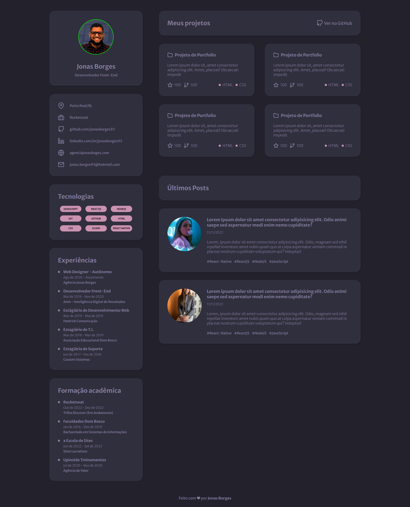

<h1 align="center">
  
</h1>

  <a href="#-tecnologias">Tecnologias</a>&nbsp;&nbsp;&nbsp;|&nbsp;&nbsp;&nbsp;
  <a href="#-projeto">Projeto</a>&nbsp;&nbsp;&nbsp;|&nbsp;&nbsp;&nbsp;
  <a href="#-requisitos">Requisitos</a>&nbsp;&nbsp;&nbsp;|&nbsp;&nbsp;&nbsp;
  <a href="#-layout">Layout</a>&nbsp;&nbsp;&nbsp;|&nbsp;&nbsp;&nbsp;
  <a href="#-layout">Instalação</a>&nbsp;&nbsp;&nbsp;

 

## 🚀 Tecnologias

Esse projeto foi desenvolvido com as seguintes tecnologias:

&nbsp;
&nbsp;
&nbsp;
&nbsp;
&nbsp;

## 💻 Projeto

Desenvolver um tema do zero, afim de praticar e entender melhor a anatomia de um tema wordpress, onde vou replicar à página que eu criei na [Trilha Discover](https://www.rocketseat.com.br/discover)</b> da [Rocketseat](https://rocketseat.com.br), esse é um projeto onde a ideia é deixar todas as informações editáveis para qualquer desenvolvedor poder utilizar.

## ✅ Requisitos

Neste projeto vou construir o meu prórpio portfolio utilizando wordpress
- Utilizar o Layout de referência do projeto [Discover-DesafioPortfolio](https://github.com/jonasborges93/Discover-DesafioPortfolio)
- O projeto deverá ser em Wordpress
- Desenvolver o Tema do Zero, sem utilizar nenhum tipo de contrutor de páginas.
- O Design deverá ser responsivo e funcionar em todos os tamanhos de tela

<b>Futuras atualizações</b> 
- Consumir a API do Git Hub

## 🎨 Layout
 

  

Você pode visualizar o layout do projeto através [desse link](https://www.figma.com/file/L6fCiWtOgXCfslQdezqQeF/DD-Portfolio/duplicate). É necessário ter conta no [Figma](https://figma.com) para acessá-lo.

## ⚙ Instalação
Para realizar o instalção, é necessário ter um wordpress limpo, você pode baixar através do [desse link](https://wordpress.org/download/). 

- Após as configurações iniciais, clonar o repositório na pasta 'wp-content/themes'.

- Realizar a ativação do tema na sua tela de administrador do wordpress em 'aparencia/temas'.

- Para o tema rodar corretamente, é necessário a instalação do plugin Advanced Custom Fields (ACF) no Wordpress.

## :memo: Licença

Esse projeto está sob a licença MIT. Veja o arquivo [LICENSE](LICENSE.md) para mais detalhes.

---

Feito com ♥ por: <b> [Jonas Borges.](https://github.com/jonasborges93)</b>